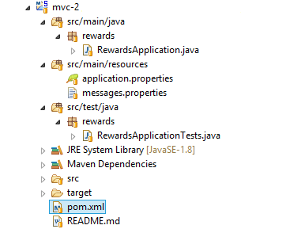

# mvc-2

In this lab you will gain experience with building a Spring Web/MVC application using Spring Boot.

What you will learn:

1. How to develop a Spring MVC web application using Spring Boot
2. How to configure a Spring Boot project

Estimated time to complete: 30 minutes

## General notes about this lab

This lab is different than all the other labs you have done so far. In this lab, you start with just a minimal Spring Boot application and build on it. **There are no TODO items in this lab.** Instead there is just one set of instructions - you are reading them!

## Lab instructions

Here is the outline of this lab. Details of each are provided below.

1. Inspect the Spring Boot project
2. Verify everything is working
3. Start the application (as a Spring Boot App)
4. Start the application (as a traditional Web App)
5. Add database, initial data, and other rewards application artifacts
6. (Bonus) Add Actuator (metrics)

### Inspect the Spring Boot project

The `mvc-2` project we provide looks like this:

Look at what a Spring Boot project looks like:

- The standard Java / Maven project folder structure.
- A Maven build file. Boot works perfectly well with Gradle but this lab environment is established for Maven.
	- Open the Maven build file (`pom.xml`) and click on the `pom.xml` tab on the bottom of the editor.
	- Unlike a typical Spring Boot project, it *does not* have `spring-boot-starter-parent` as its parent, because all the labs in this course already inherit from our course parent POM. However, you will find the Web starter, `spring-boot-starter-web` in the parent POM.
- A simple JUnit test class (`RewardsApplicationTests.java`)
- A Bootstrap class (`RewardsApplication.java`)
	- This class contains the main method needed to start a Spring Boot application.
	- The single `@SpringBootApplication` annotation is a meta-annotation combining the `@Configuration` , `@EnableAutoConfiguration` , and `@ComponentScan` annotations.

### Verify everything is working

You already have a working Spring Boot application now. You can test your project by executing the
`RewardsApplicationTests` using JUnit. Run the test and make sure it passes.

### Start the application (as Spring Boot App)

Your application is now ready to start. But first, make sure you don't have a server running from a previous lab. If you do, stop it; it will cause a conflict on port 8080 if it is still running.

*When running a Spring Boot web-application, if you get an error about the Tomcat Connector in a failed state it just means the port is already in use.*

A Spring Boot web application can run in any web container compliant with the Servlet 3.0 API, but we will run our project as a standard Java application. The application can run from the IDE, we don't have to package it in any way, launching a main class will do the trick! Right-click on the `RewardsApplication` and select "Run As > Spring Boot App". Once running, open `http://localhost:8080` in your browser. You should get a 404, as we haven't created anything yet.

*When running outside of a container, there is no need to specify the application's context in the servlet container, since there is only one application. This is why the URL is not* `http://localhost:8080/mvc-2`.

*Spring Boot packages the embedded Tomcat JARs to allow it to run without a container. If you never intend to run outside of a container, you can simply exclude these JARs using Maven/Gradle.*

### Start the application (as a traditional Web App)

At this point, the application is run as a standard Java application (with an embedded Servlet container). We will now make it a standard Java Servlet web application. Modify `pom.xml` and change the packaging from "jar" to "war". Save your changes. Right-click on the project and select "Maven > Update project...". In the dialog, ensure that only the project is selected, and click OK. This will change the JAR project into a WAR project.

The Servlet 3.0+ requires a Servlet Initializer or a `web.xml`. We shall go with the Servlet Initializer approach (i.e. no `web.xml`). Spring already provides a  Servlet Initializer - `SpringServletContainerInitializer`. It enables `WebApplicationInitializer` classes to be loaded. With Spring Boot, we don't need to create a sub-class of `AbstractAnnotationConfigDispatcherServletInitializer` (or `AbstractDispatcherServletInitializer`, or `AbstractContextLoaderInitializer`). Instead, Spring Boot provides its own `WebApplicationInitilizer` in `SpringBootServletInitializer`. Modify `RewardsApplication` to extend `SpringBootServletInitializer` and override the `configure()` method. In the method override, add the class as a source for the builder.

	@Override
	protected SpringApplicationBuilder configure(SpringApplicationBuilder builder) {
		return builder.sources(RewardsApplication.class);
	}

Now, we're ready to run the application as a standard Java Servlet web application (inside a container)! Right-click on the `RewardsApplication` and select "Run As > Run on Server". In the dialog, click Finish. Once running, open `http://localhost:8080/mvc-2` in your browser. You should get a 404, as we still haven't created anything yet.

Stop the web application before proceeding. Now that the project is a standard Java Servlet web application, Eclipse/STS will automatically restart the web app when there are changes to the source files. Since we will be making several additions in the next section, it would be best that the web application server is stopped to prevent unnecessary restarts.

### Add database, initial data, and other rewards application artifacts

In this section, we will add a database, set-up some initial data, and the rewards application artifacts that we used in the previous lab. Then we will copy the JSPs and controllers from the last lab and re-create the online rewards system.

**Add application artifacts**

Copy the following packages from a previous lab (`mvc-1`):

- `common`
- `rewards.application`
- `rewards.domain.model`
- `rewards.infrastructure.jpa`
- `rewards.web`
	- But only the `AccountsController`
	- Do not copy the `HomePageController` and `RewardsServletContainerInitializer`
- `messages.properties` (in `src/main/resources`)

Do not copy `rewards.config`.

*One interesting thing to note at this point is that we do NOT need to define a* `DataSource`*,* `TransactionManager`*, or JPA* `EntityManagerFactory` *- Spring Boot will deduce that we need these, based on the fact that we have JDBC data source and JPA JARs on our classpath!*

We will also need the SQL schema and initialize it with some data. For this, copy the `rewards` folder under `src/main/resources` from `mvc-1` (a previous lab) to `src/main/resources` in `mvc-2` (this current lab). This copies the needed SQL scripts.

Next, open `application.properties` (it's located at `src/main/resources`) and add the following lines:

	# Control how Boot loads data when it starts:
	spring.jpa.hibernate.ddl-auto=none
	spring.datasource.schema=classpath:/rewards/schema.sql
	spring.datasource.data=classpath:/rewards/test-data.sql

1. `spring.jpa.hibernate.ddl-auto` - Instruction to Hibernate on what its policy should be regarding automatically creating database tables based on annotated classes. Ordinarily it tries to do this for us when using an in-memory database, so we are asking it not to.
2. `spring.datasource.schema` / `data` - Locations of any SQL files to be executed on application startup.

Before going further, let's make sure the last few steps were done correctly. Save all your work and restart your web application ("Run As > Run on Server"). In [http://localhost:8080/mvc-2](http://localhost:8080/mvc-2), you should still get a 404. But in the console, you should see logs that indicate that the SQL scripts are being executed. If you do not, you probably made a mistake on one of the previous steps. Be sure the application starts before proceeding. Next, we will add the JSPs.

**Add web presentation-layer artifacts**

Next, we want to re-create the JSPs from the a previous lab (`mvc-1`). Rather than create them from scratch we will simply copy most of this.

COPY the `webapp/WEB-INF/views` folder from `mvc-1` project to the `webapp/WEB-INF/views` folder in `mvc-2` project.

Next, you may recall from Spring MVC that we typically need an `InternalResourceViewResolver` setup. Spring Boot will take care of this for us, but does not know what to use for prefix and suffix. Boot uses a property file called `application.properties` that we can use to configure this kind of thing very easily (as we've done previously with the SQL scripts). Open `application.properties` again and add the following lines:

	# Control the InternalResourceViewResolver:
	spring.mvc.view.prefix=/WEB-INF/views/
	spring.mvc.view.suffix=.jsp

Spring Boot supports a static `index.html` as the home page. But our home page is a JSP (not static HTML). To make this work, we need to tell Spring that we need a view controller as the home page. Create a `@Configuration` class that is sub-class of `WebMvcConfigurerAdapter`. Place this sub-class in the `rewards.web` package. This way, it will be loaded by Spring Boot, since `@SpringBootApplication` is a meta-annotation that contains `@ComponentScan` which scans sub-packages for components to be loaded.

In the `WebMvcConfigurerAdapter` sub-class, override the `addViewControllers()` method and configure a view controller mapped to "/" URL (home page).

	@Override
	public void addViewControllers(ViewControllerRegistry registry) {
		registry.addViewController("/").setViewName("index");
	}

Do not add `@EnableWebMvc` in the `WebMvcConfigurerAdapter` sub-class configuration, as this will take away all the Spring Boot extras. Since we just want to keep all the Spring Boot MVC auto-configuration, and add a view controller, we *do not* use `@EnableWebMvc`.

Save all your work and restart your application. Open [http://localhost:8080/mvc-2](http://localhost:8080/mvc-2).

You should see the rewards online pages from the previous lab.

**Congratulations, you have completed this lab!** But before moving on, consider all of the items that you did NOT have to do, because Spring Boot did them for you:

1. You did NOT define a dataSource - Spring Boot noticed that you did not, and noticed HSQL on the classpath, and created one for you.
2. You did NOT define an `EntityManagerFactoryBean`, or a `JpaVendorAdapter` - Spring Boot noticed a JPA implementation on the classpath and set this up for you, using the `DataSource`.
3. You did NOT define a `PlatformTransactionManager` - Spring Boot assumed you would need one when working with JPA.
4. There is no `web.xml` file. Spring Boot is using a Servlet Initializer.
5. You did NOT define the `DispatcherServlet`, or a Servlet Mapping - Spring Boot noticed Spring MVC JARs on the classpath and defined this for you.
6. You did NOT define an `InternalResourceViewResolver` - Spring Boot did this for you, and allowed you to easily define the prefix and suffix.
7. You did NOT define a `messageSource` bean - Spring Boot did this for you, and defaults to `classpath:/messages`.

### (Bonus) Add Actuator (metrics)

Now let's use Spring Boot Actuator to get some runtime information. To enable the Actuator, we just need to add a dependency for it to our `pom.xml` file. Check the following dependency is set up in the POM:

	<dependency>
		<groupId>org.springframework.boot</groupId>
		<artifactId>spring-boot-starter-actuator</artifactId>
	</dependency>

There are several Spring Boot Actuator URLs, such as:

- The Spring Beans: [http://localhost:8080/mvc-2/beans](http://localhost:8080/mvc-2/beans)
- Environment: [http://localhost:8080/mvc-2/env](http://localhost:8080/mvc-2/env)
- Controller mappings: [http://localhost:8080/mvc-2/mappings](http://localhost:8080/mvc-2/mappings)

For more details, refer to the Actuator section of the Spring Boot documentation.

**Congratulations, you have completed the bonus sections of this lab!**
